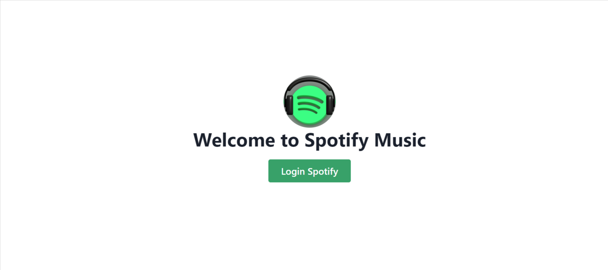
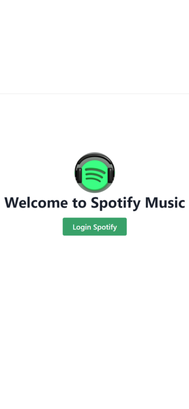
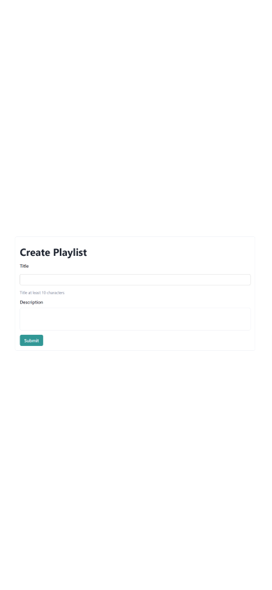

# My Spotify Music

## Description

<br>

This is Spotify clone app that used Spotify Developers API. Spotify clone enables users to share their favorite songs, detail tracks, create a new playlist, and select and deselect songs
<br>

### Features
- Login 
- Create a new playlist 
- Search Songs 
- Tracks Detail
**Select and Deselect playlist**

## How to use this App

1. Click Login Spotify Music
<br>


2. After successful authentication, we will go to the your profile page.

3. Create Playlist
make a new playlist, write the title and description and click create.

4. Search Tracks
Search the song and click button search, and the result will appear.

5. Track Detail
The track will show the title, the artist and the duration of the song.

6. Select and Deselect
Select the song that you want to make

## How to instal and use
*Clone the project
*Go to the project app
   ```
   cd my-spotify
   ```
*Install dependencies
   ```
   npm install
   ```
*Start the server
    ```
    npm start
    ```
*Start server
   ```
   http://localhost:3000/
   ```
